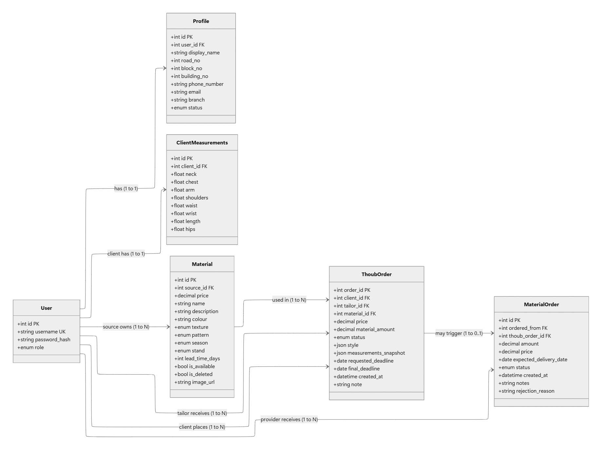
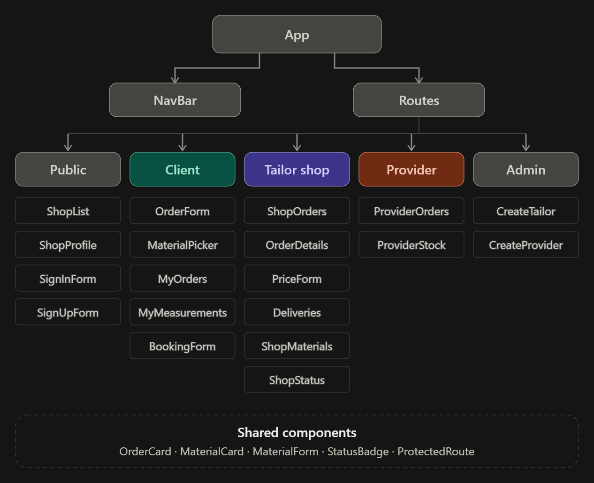


# Thobic Backend


## Overview

Thobic is a web-based platform designed to automate and simplify the process of ordering and tailoring Thawb (traditional Arabic men's clothing).

The platform connects clients, tailoring shops, and external material providers in one centralized system. It reduces the need for clients to physically visit tailoring shops for measurements, material selection, price negotiation, and delivery arrangements.

It also simplifies the process of requesting and supplying materials from external providers when the required material is not available in the tailor's stock.

---

## Core Idea

The website automates the process of ordering and tailoring Thawb (Arabic men's clothing) by connecting the client with both the tailoring shop and external material providers in one platform.

The website aims to:

- Simplify the process of creating and managing Thawb orders.
- Allow clients to select materials from the tailor's available stock.
- Allow clients to request materials from external providers when needed.
- Store and reuse client measurements for future orders.
- Reduce the need for physical visits to tailoring shops.
- Simplify communication between clients and tailors.
- Help tailors manage orders, materials, and order statuses.
- Allow material providers to manage their inventory and material orders.

---

# User Stories

## Client

- AAC, I want to be able to sign-up, sign-in, sign-out to the website safely and securely.
- AAC, I want to be able to create an order and assign to a specific tailor or tailor shop branch in website.
- AAC, I want to be able to select a material for the order.
- AAC, I want to be able to select a material from a provider if I didn’t like any of the in-stock tailor materials.
- AAC, I want to be able browse among the materials and filter them.
- AAC, I want to be able to add my measurements and save them to autofill the order form in case of another order.
- AAC, I want to be able to update my measurements and save changes.
- AAC, I want to be able to delete my measurements.
- AAC, I want to be able to book an appointment for measurements in the physical location.
- AAC, I want to be able to update the order details whenever I want before the Tailor accepting it.
- AAC, I want to be able to delete the order before accepting it.
- AAC, I want to be able to reject or approve the order after determining the price and changing the deadline by the tailor.
- AAC, I want to be able to confirm that my order was delivered.
- AAC, I want to be able to browse tailoring shops and view a shop profile.
- AAC, I want to be able to filter the tailoring shops.
- AAC, I want to be able to view the profile and details of the tailoring shop.

---

## Admin

- AAA, I want to be able to sign-in and sign-out.
- AAA, I want to be able to create a Tailor account.
- AAA, I want to be able to create a Provider account.

---

## Tailor

- AAT, I want to be able to sign-in and sign-out safely and securely.
- AAT, I want to be able to view all orders assigned to me and their status.
- AAT, I want to be able to view all the material orders that are delivered or will be delivered to me.
- AAT, I want to be able to either accept or reject the orders that are coming to me.
- AAT, I want to be able to send a response to the client with a request of confirming the price and the delivery time.
- AAT, I want to be able to update the status of the location from open, close, or busy.
- AAT, I want to be able to update the status of the client location from pending to accepted, to in progress, to ready, to in the way.
- AAT, I want to be able to see a summary of the orders that are assigned to me.
- AAT, I want to be able to add the in-stock material to the system.
- AAT, I want to be able to change the in-stock material between the currently unavailable and currently available.
- AAT, I want to be able to mark a material order as delivered.

---

## Provider

- AAP, I want to be able to sign-in and sign-out safely and securely.
- AAP, I want to be able to add the in-stock material in the system.
- AAP, I want to be able to see all order materials sent to me.
- AAP, I want to be able to accept and reject the order materials sent to me.
- AAP, I want to be able to update the status of the order from pending to accepted.
- AAP, I want to be able to update the status of the order from accepted to on the way.
- AAP, I want to be able to update the information of the materials that are in my stock.
- AAP, I want to be able to mark the information of the materials that are in my stock as deleted.
- AAP, I want to be able to mark a specific material at my store as not available.

---

# Entity Relationship Diagram

The following ERD represents the main entities and relationships used in the Thobic platform.



---

# Wireframes

The following wireframes represent the main user interfaces and flows of the Thobic platform for Clients, Tailors, Providers, and Admins.


---

# Front-end

## Components Hierarchy





---

# Project Structure

```text
Thobic-Backend/
│
├── controllers/
├── models/
├── routes/
├── serializers/
├── dependencies/
├── database/
├── main.py
├── requirements.txt
└── README.md
```

---

# Backend

The backend is responsible for handling the application's business logic, database operations, authentication, user roles, orders, materials, measurements, and communication between clients, tailors, and providers.

## Main Backend Responsibilities

- User authentication and authorization
- Role-based access control
- Client management
- Tailor and tailoring shop management
- Provider management
- Order management
- Material management
- Client measurement management
- Material order management
- Order status management
- Appointment management
- Database communication

---

# User Roles

The platform contains four main user roles:

| Role     | Description                                                                       |
| -------- | --------------------------------------------------------------------------------- |
| Client   | Creates Thawb orders, selects materials, manages measurements, and tracks orders. |
| Tailor   | Manages tailoring orders, materials, prices, deadlines, and order statuses.       |
| Provider | Manages material inventory and handles material orders from tailors.              |
| Admin    | Manages Tailor and Provider accounts.                                             |

---

# Future Development

The platform can be extended with additional features such as:

- Online payment integration
- Notifications
- Real-time order tracking
- Advanced material search and filtering
- Customer reviews and ratings
- Delivery management
- Analytics and reporting
- Mobile application support

---

# Team

Thobic is a software engineering project focused on simplifying the traditional Thawb ordering and tailoring process through a centralized digital platform.
